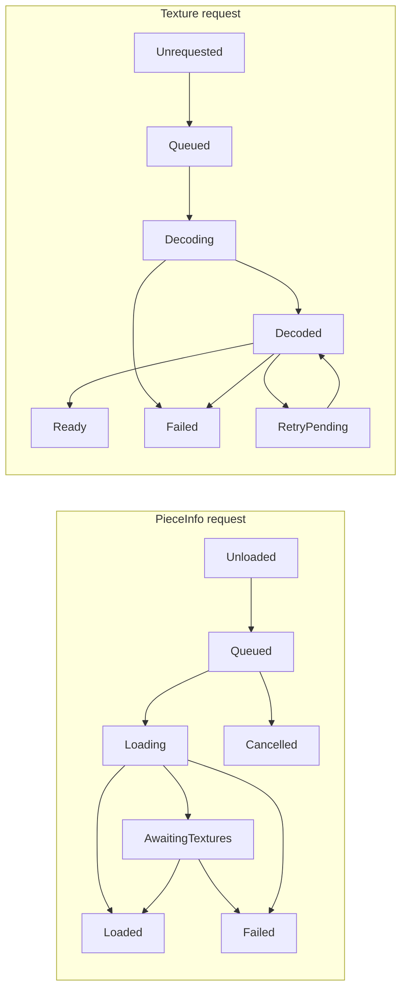
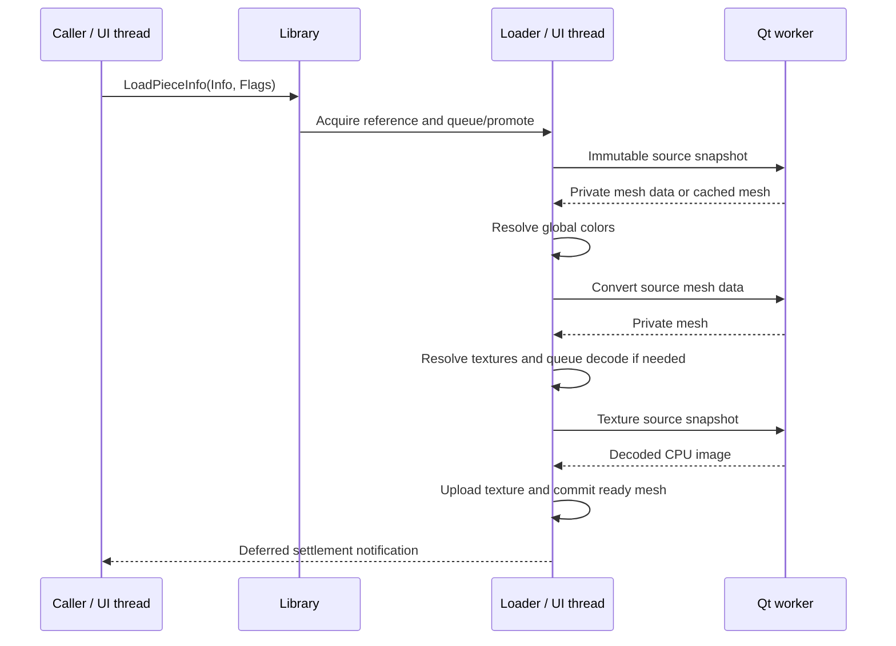

# Asset loading

This guide describes the current implementation. Update it with changes to
loading, ownership, readiness, scheduling, or output policy. Names below refer
to existing APIs, rather than proposed interfaces.

This is the implementation record replacing the streaming-assets plan. It
documents the current contracts and accepted decisions, rather than retaining
completed stages or superseded proposals as future requirements.

## What users see

Opening a model still parses its file on the UI thread, but does not wait for
every referenced mesh or texture. Unavailable geometry initially draws as cubes;
pieces appear incrementally once their meshes **and textures** are ready.
Already-loaded shared assets can appear immediately. A disk cache hit still
requires worker loading and any texture dependencies; it is not a UI-thread fast
path and receives no special queue priority.

The status-bar spinner is visible while the active project has pending pieces
or generated meshes. Its tooltip reports loading counts, or regeneration when
only synth work remains. Counts describe unique required `PieceInfo` identities
plus generated piece instances, not the number of placed bricks or global jobs.
Requirements include all project models and their nested dependencies, not just
the visible step. The spinner hides immediately when work settles; there is no
"all pieces loaded" message. A separate failure indicator retains error details
until the project's failures disappear or the project changes.

Views redraw and update bounds as results arrive, but keep the user's camera.
During synth edits, the previous generated mesh stays visible until a replacement
settles. Images and geometry exports wait for their requirements and omit failed
geometry instead of saving loading cubes. See [Caller policies](#caller-policies)
for the deliberately stricter preview rules and thumbnail fallbacks.

## Accepted decisions

These decisions are the baseline, not open TODO items. Do not propose reversing
them merely because another design is possible or an older requirement differs.
Revisit one only at the user's request or when a concrete regression, changed
requirement, or relevant measurement invalidates its rationale. Explain that
new evidence and update this record with any agreed change.

| Decision | Rationale and alternatives set aside |
| --- | --- |
| Keep identities, sources, references, and shared buffers in the library; pending work belongs to its loader. | One registry and one completion path avoid competing lifetime/readiness authorities. Do not create a second asset registry in the loader. |
| Use the existing Qt worker pool and shared offscreen GL context, with UI-thread publication. | Reuses existing infrastructure and keeps model mutation, color registration, upload, and rendering sequential. Do not publish assets from workers or introduce a separate renderer/context for loading. |
| Use promotion-only priorities and existing reference counts. | Models open at their last step; precise consumer demotion added bookkeeping for little demonstrated benefit. Per-consumer pointer maps, step-based priorities, outgoing-project demotion, and scoped priority removal were deliberately set aside. Accept briefly elevated work after a requesting view closes. |
| Treat missing geometry as `Failed`; keep structural type and library membership separate. | A separate Placeholder/Missing type or readiness value duplicates failure state. Cubes are shared display fallbacks, not stored asset meshes. Library membership is established explicitly by the `PieceInfo` constructor. |
| Require all includes and textures for successful asset loading; never cache an erroneous mesh as successful. | Partial private builds must not masquerade as ready assets. Permissive output is a caller policy that omits failed assets, not relaxed loader success criteria. |
| Allow model outputs to save available geometry after waiting. | Geometry exports, HTML, images, instructions, and printing do not reject the whole operation because an asset failed. Actual rendering/file failures remain errors. Strict previews and thumbnail fallback rules remain separate. |
| Keep missing HTML parts-list entries with empty thumbnails and quantities. | Missing geometry must not erase the inventory entry or substitute a loading cube. Instruction parts lists currently omit unavailable thumbnails. |
| Fit outputs to available geometry; interactive fitting includes fallbacks. | Failed cubes must not distort exported framing. Include root direct geometry and available children, preserve explicit cameras, and never automatically refit interactive views as assets arrive. |
| Build synth meshes per instance on workers; retain the previous generated mesh during edits and cancel obsolete work cooperatively. | Control points belong to placements, not shared library assets. Keep interactive edits stable while ensuring output never mistakes an older mesh for the completed replacement. |
| Keep the uncached mesh draw path and debounced shared-buffer repacking. | Measured repacking cost was small and repeated scenes benefited from shared buffers. Per-mesh buffers, visibility-triggered uploads, and mesh-buffer upload as a readiness requirement were set aside without evidence of a benefit. Texture upload remains part of readiness. |

## Responsibilities and entry points

| Owner | Responsibility | Source |
| --- | --- | --- |
| `lcPiecesLibrary` | Asset identities, references, source discovery, archives, primitive and mesh caches, settings, shared mesh buffers, and public forwarding APIs. | [lc_library.h](../common/lc_library.h), [lc_library.cpp](../common/lc_library.cpp) |
| `lcAssetLoader` | Pending requests, worker scheduling, private results, texture upload, publication, cancellation, readiness waits, and deferred settlement notifications. | [lc_assetloader.h](../common/lc_assetloader.h), [lc_assetloader.cpp](../common/lc_assetloader.cpp) |
| `PieceInfo` / `lcTexture` | Published geometry or texture data, readiness state, and asset metadata. | [pieceinf.h](../common/pieceinf.h), [lc_texture.h](../common/lc_texture.h) |
| Projects, models, and views | Project-local names, required-asset traversal, generated-piece ownership, bounds, fallback display, cameras, and redraws. | [project.cpp](../common/project.cpp), [lc_model.cpp](../common/lc_model.cpp), [piece.cpp](../common/piece.cpp) |

The library owns the loader. Call library entry points from the UI thread for
asset acquisition, release, scheduling, waiting, and invalidation. Workers use
source snapshots and the library's build services; they do not consult the
active project or publish into live models.

`FindPiece()` returns a borrowed identity, without acquiring a reference. Lookup
checks the supplied project's name index, then the shared library catalog, then
optionally an external file beside the project. Creating a missing identity
records `Failed`. `CreateModelPiece()` differs: it returns one acquired reference
for the model to release. Library membership is independent of readiness and
Part/Model/Project type. Project-local names cannot replace another project's
names. Worker include resolution uses library sources, while model geometry and
texture search directories are snapshotted before dispatch.

### Project-local identities and source paths

`Project::mPieceIndex` maps normalized local filenames to borrowed `PieceInfo`
pointers. "Project-local names" means lookup visibility, not object ownership:
the library tracks local identities separately in `mProjectPieces`, and reference
counts govern their lifetime. Models know their owning project from construction;
temporary models can have no project. Do not use the active project implicitly
when resolving a candidate project, external file, or preview.

This scope lets different open/candidate/preview projects use the same submodel
name without replacing one another's identities. Containers remain structurally
Model or Project even when their direct mesh fails. The shared catalog remains
separate; worker primitive/part includes must not accidentally resolve through
a project's name index.

Source directories are also distinct from the project's current save filename.
Models preserve asset search directories when moving between projects or saving
to a new folder, so embedded geometry can still find its source textures. Save As
uses `QSaveFile`; source state and the old filename are restored if writing or
commit fails. After a successful folder change, local external references are
remapped in place against the destination folder and direct model meshes are
invalidated/requeued. Missing replacements become failed identities and retain
their references. Saving in the same folder skips this remapping.

Merge validates name/identity conflicts before mutating either project, renames
conflicting submodels, transfers local registrations, and preserves source
directories. Renames update live instance IDs and undo/redo snapshots. Deletion
and project teardown unregister borrowed index entries; they must not leave
lookup pointers to deleted objects. These paths are in
[project.cpp](../common/project.cpp) and [lc_model.cpp](../common/lc_model.cpp).

### Active project file monitoring

Only the active project's own file is watched. Preview projects, loading
candidates, and referenced model projects do not register filesystem watches.
`lcApplication::SetProject()` activates the new project's watcher after changing
the active project. Loaded bytes and committed saves establish its content hash
baseline, so unchanged rewrites, metadata updates, and own saves do not prompt.

File and containing-directory events are debounced before checking the active
file's contents, existence, and readability. Directory watches reattach after
replacement and detect deletion/recreation, including missing parent directories.
Transient read failures receive bounded retries. Events for unrelated files in
the directory only cause the current file to be checked.

The reload handler verifies the active project and filename before showing a
dialog and after the response. Candidate ownership is scoped so failed reloads
release their resources. Referenced files retain their existing loading and
readiness policies and are not monitored or reloaded in response to filesystem
events.

## Readiness

The diagram shows the normal paths. Mesh parsing and conversion are separate
worker phases, so a part can return to `Queued` between phases. Invalidation or
unloading resets readiness; cancellation and stale-result disposal also have
request-level terminal flags, independent of the published asset state.

A part becomes `Loaded` after its private mesh is committed and all declared
textures are ready. Valid empty geometry may also settle successfully. A missing
include or declared texture is a failure, even if some geometry was built.
Texture names remain in mesh sections and cache data when lookup fails.

A texture is ready only when `IsReady()` reports `Ready` with a nonzero GL
texture. CPU pixels, `HasImageData()`, and `!NeedsUpload()` do not establish
readiness. The completion pump uploads through the global shared offscreen
context without requiring the part to be drawn. Upload failures retry at most
three times, with 50 ms and 200 ms delays; decoding failures settle immediately.
Loader-decoded textures receive `LC_TEXTURE_MIPMAPS`.

**Container readiness is not recursive readiness.** A Project `PieceInfo`, or a
Model without direct geometry, can be `Loaded` while its children are pending
or failed. Models with directly embedded geometry have their own mesh request.
Use `lcModel::GetRequiredPieces()` and `GetRequiredSynthPieces()` for recursive
requirements, including nested and external models, with cycle protection.

### Diagnostics and retries

Part error text lives in the library's sparse `mFailedPartErrors` map, queried
through `GetPieceLoadError()`, rather than an empty string in every catalog part.
Synth error text is likewise sparse in the loader and available through
`GetSynthMeshError()`. Entries must be cleared when their identity is unloaded,
deleted, invalidated, or successfully rebuilt; synth cancellation also clears
its entry. Pointer-keyed errors must not survive destruction and later attach
to a different object allocated at the same address.

Textures store a compact `lcTextureLoadError` enum. The loader's static
`TextureFailureMessage()` translates it into user-facing text when reporting a
dependency failure. Missing includes and texture names remain in diagnostics;
an empty error string alone does not prove readiness. Preserve translatable
messages and check state/result rather than parsing error text.

Only GPU upload attempts receive the bounded automatic retry described
above. Missing files, invalid source geometry, and decode failures do not produce
an endless render-time retry loop. A strict caller reports failure; a permissive
caller omits unavailable geometry, while the loading indicator exposes errors.

## A request from acquisition to notification

Texture-free meshes skip decoding/upload; cached meshes skip source parsing and
conversion. Both paths use the same dependency and publication rules. Cache
reads and mesh deserialization run on workers; source mesh color indices are
resolved on the UI thread before conversion uses a color snapshot. A corrupt
mesh cache is rebuilt privately. Failed builds are not saved as successful mesh
caches. Temporary disk textures are scoped by their resolved file identity, so
same-name PNGs in different project directories remain distinct.

Mesh cache validity includes the cache format, source checksums, stud style, and
stud-cylinder color setting. Style flags propagate through nested primitive
includes. `LoadPrimitive()` returns `lcResult<void>` with include errors and
clears partial data on failure, so failed primitive builds cannot seed a later
successful mesh with incomplete cached geometry.

Workers post results and wake the loader's completion event. `ProcessCompletions()`
processes at most 16 completions per pump, including texture retries. Publication
and rendering remain sequential on the UI thread. `DispatchNotifications()`
later delivers `PartLoaded`, `PartLoadFailed`, and `GeneratedMeshSettled`, with
bounded batches and stale-target checks. Synchronous waits drive completion
processing but defer these public settlement notifications to the event handler;
they do not run an unrestricted nested UI event loop. `AssetRequestsChanged`
also signals request-list or consumer changes and is not a success notification.

The main window coalesces updates, propagates affected bounds, and redraws views.
Its loading indicator counts the active project's requirements, including
generated meshes; unrelated work does not keep that indicator visible. Mesh
publication schedules a debounced shared-buffer repack after loader work becomes
quiescent. Until then, meshes draw through the existing uncached path. Shared
buffer upload is not part of asset readiness.

## References, cancellation, and generated geometry

`LoadPieceInfo()` acquires one reference even if loading fails. Always pair it
with `ReleasePieceInfo()`. Its asynchronous return value means the call did not
wait, not that the asset loaded. `AddPieceReference()` retains an identity without
starting work. `EnsurePiecesReady()` deduplicates its input, temporarily holds
each part, and releases those holds before returning.

A part request owns an additional in-flight reference. Removing one instance
cannot destroy an asset still used by another instance or pending work. On the
last consumer release, queued work is removed; running ordinary part work is
allowed to finish and its result is discarded if no consumer survives. Successful
or failed publication keeps the request's hold through deferred notification,
then releases it. Library piece identities can remain in the catalog after their
geometry unloads; unreferenced local leaf identities can be deleted. Model and
external-project containers have their own teardown rules.

Texture requests likewise hold a reference, and staged/published mesh sections
hold their texture dependencies. Cancellation removes unused queued texture work
without releasing another mesh's texture. Failed assets remain terminal while
retained; drawing does not retry them. Explicit invalidation or unloading can
permit a later request.

Synth meshes are **per `lcPiece` instance**, separate from the shared library
mesh. `QueueSynthMesh()` copies control points and retains the shared synth
definition. Replacing or deleting the piece cancels its old request; workers
check an atomic cancellation flag and stale results cannot replace newer meshes.
Initial generation displays a cube. Control-point edits retain the previous
generated mesh until replacement settles; that older mesh does not satisfy a
wait for the new generation. Settlement holds the base `PieceInfo` through its
deferred notification. See [lc_synth.cpp](../common/lc_synth.cpp) and
[piece.cpp](../common/piece.cpp).

Interactive fallback rendering, bounds, ray/box picking, and selection outlines
use the same displayed geometry and keep the original instance identity. A
model's unavailable direct geometry can display a local cube while its children
remain independently visible/selectable. Failed containers retain their
structure; deleting a model or external project detaches its pointers explicitly.
Undo restores external references using project-folder lookup, not only the
library catalog. Placeholder appearance must never change piece type or asset
ownership.

## Scheduling and waits

Priorities only promote: `Background < Visible < Blocking`. Ordinary thumbnail
requests start Background; asynchronous model pieces and generated meshes start
Visible, regardless of step. Synchronous waits promote their required requests
and pending texture dependencies to Blocking. Shared textures retain the highest
promotion received from any parent or direct wait. There is no consumer identity
map, priority demotion, or step-based scheduling. Priority lasts until that request
completes or is cancelled, not merely until the requesting view closes.

At most four QtConcurrent drain workers run (fewer if the machine reports fewer
threads). Running work is nonpreemptive. Queued work gains one scheduling priority
level per ten seconds of waiting, capped at Blocking, with oldest work winning
ties. Completion processing uses promoted priorities. Acquiring a pending asset
shares its request rather than submitting another build.

`EnsurePieceReady()` / `EnsurePiecesReady()` wait for the supplied identities,
not the entire library, and return false for failed or cancelled requirements.
They do not expand model containers themselves. `EnsureSynthMeshesReady()` waits
for the specified instances; `EnsureTextureReady()` waits through upload.
`lcModel::WaitForAssets()` combines recursive part and synth waits and updates
bounds, but deliberately ignores their failure results. `EnsureAssetsReady()`
adds strict failure reporting. `WaitForLoadQueue()` drains all pending work and
workers, including unrelated assets; it is not a scoped success check.

### Choosing an API

| Need | API and lifetime contract |
| --- | --- |
| Resolve a name | `FindPiece()` with the intended project and explicit `CreateMissing` / `SearchProjectFolder` arguments. The returned pointer is borrowed; retain it before keeping it beyond its owner's lifetime. |
| Retain and start ordinary asynchronous work | `LoadPieceInfo()` without `lcPieceLoadFlag::Wait`; add `Visible` for model/view work. Pair every acquisition with `ReleasePieceInfo()`, including failures. |
| Retain without starting work | `AddPieceReference()`, paired with `ReleasePieceInfo()`. This does not make geometry ready. |
| Wait for an explicit part set | `EnsurePiecesReady()` (or `EnsurePieceReady()`), check the boolean for strict consumers. Temporary holds end before return, so the caller still needs ownership if it will use the assets afterward. |
| Wait for one identity and its container geometry | `EnsurePieceAssetsReady()` settles the identity, then delegates recursive children, synths, and bounds to the model/project API. Retain the identity and its owner throughout. |
| Wait for a model, including nested synths | `WaitForAssets()` for permissive output; `EnsureAssetsReady()` for strict preview-style failure reporting. Keep the model and its pieces alive throughout. |
| Replace/wait for generated geometry | `QueueSynthMesh()` / `EnsureSynthMeshesReady()`. Supply live `lcPiece` instances; a shared part mesh or a retained previous generated mesh is not readiness for the replacement. |
| Acquire a texture directly | `FindTexture()` waits for readiness and returns an acquired texture or null. `FindTextureDeferred()` acquires without waiting; `EnsureTextureReady()` waits through GPU upload. Retain the texture during a direct wait and pair acquisition with `ReleaseTexture()`. |
| Synchronize an entire library operation | `WaitForLoadQueue()`; reserve this for operations that truly need all work drained, such as settings changes. Ordinary previews must use scoped waits. |

Scoped waits may process unrelated completions while pumping publication, but
their completion condition depends only on the requested assets. They cannot
preempt a worker already parsing, converting, or decoding another asset. Waiting
on a single container `PieceInfo` is insufficient for a submodel preview: collect
its recursive pieces and per-instance synths, or use the model-level API.

## Caller policies

| Caller | Waiting and failure behavior |
| --- | --- |
| Ordinary LDraw/LDD opening and interactive views | Parse and queue, then return. Draw shared fallback cubes for unavailable geometry; recurse through available children. Update bounds and redraw as assets settle without automatically refitting the camera. |
| Inventory import | Wait for required geometry before computing persistent placement; failure prevents using cube bounds as final layout. |
| Insertion layout | Wait for required geometry before computing persistent placement; failed geometry uses fallback boxes. |
| Preview | Wait for its recursive requirements and generated meshes; failure rejects the preview. See [lc_previewwidget.cpp](../common/lc_previewwidget.cpp). |
| Thumbnail manager | Acquire required assets asynchronously. Missing library geometry/textures produce an error thumbnail. Pending generated meshes delay rendering; synth failure can use a loaded library mesh. See [lc_thumbnailmanager.cpp](../common/lc_thumbnailmanager.cpp). |
| OBJ, COLLADA, 3DS, POV-Ray export | Wait for model requirements, then omit failed meshes and failed generated geometry. Empty output is allowed. Render/write failures still report errors. See [project.cpp](../common/project.cpp). |
| Saved images, screenshots, HTML, instructions, printing | Wait for settlement, then render available geometry without loading cubes. HTML parts lists retain missing entries and quantities with blank thumbnails; instruction parts lists omit unavailable thumbnails. Actual rendering/writing failures still fail the operation. |
| Model save, CSV, BrickLink inventory | Save references or inventory data without requiring successful geometry loading. |

Insertion waits for the candidate's recursive requirements before computing its
placement. Stacking and mouse placement also wait for the existing piece whose
geometry determines the position, including its current synth generation. Mouse
placement repeats picking after pending geometry settles. A failed candidate
replaces the previous insertion preview with the selected identity's fallback
box so a later click inserts the current selection.
Free dragging existing pieces also settles the moving piece and hit geometry,
including current synth generations, and repeats picking before placement. If
loading fails, both dragging and insertion use the available or fallback
geometry rather than rejecting placement.

Automatic output fitting uses `lcGeometryBoundsMode::AvailableGeometryOnly`;
interactive fitting uses `IncludeFallbackGeometry`. A whole-model wait can
conservatively include later steps even when output requests an earlier step.
Scene flags preventing fallback cubes do not themselves initiate a wait or
guarantee success. See [lc_view.cpp](../common/lc_view.cpp) and
[lc_scene.h](../common/lc_scene.h).

`SetRequireCompleteAssets(true)` suppresses unavailable fallback geometry and
marks missing assets in the scene; `SetRequireGeneratedMeshes(true)` also excludes
the fixed library mesh when the current synth generation is unavailable. A
strict renderer checks `HasMissingAssets()` after drawing. Permissive output
uses these exclusion rules without making missing assets an operation-wide error.
Do not infer readiness from a successfully allocated framebuffer or a nonempty
image: it may still contain only the available portion of a model.

Thumbnail identity is based on `PieceInfo`, not just its filename. Pending
thumbnails retain recursive requirements and receive settlement notifications.
Category resets release thumbnail IDs before repopulating the list. The submodel
category excludes models that include the active model, preventing recursive
insertion. `lcThumbnailManager::RefreshPieces()` refreshes affected identities
and requirements after Save As remapping; preserve that refresh when changing
sources without changing pointers. The preview dock's `RefreshModel()` checks
its recursive requirements and respects its lock; it refreshes a displayed
submodel affected by editing elsewhere, not an editable temporary preview model.

Wait and propagate final bounds **before** automatic output fitting, not only
inside the later image-rendering call. CLI automatic fitting uses the requested
step for one image and the last step for an image range, reusing that camera
across the range. Named cameras and explicit positions are preserved. Headless
HTML output likewise fits the last step and reuses its camera. Temporary steps,
cameras, framebuffer state, and the caller's GL context must be restored on
success and failure; texture upload preserves the previous context/surface.

### Geometry collection versus inventory

`Project::GetModelParts()` is the settled, flattened geometry list used by 3D
exporters. Entries carry an explicit mesh for generated or directly embedded
geometry, including root geometry; exporters must prefer that mesh over the
shared `PieceInfo` mesh. Failed entries and unfinished/failed synth replacements
are filtered out. A retained editing mesh is not exported as the new generation.
This list is separate from `GetPartsList()` inventory traversal: changing export
collection must not remove missing references from inventories or turn direct
model geometry into an ordinary catalog part.

Project-local filenames are not necessarily safe export identifiers. COLLADA
and POV-Ray identifiers use `Project::MakeExportNameFragment()` and
`MakeUniqueExportIdentifier()`: preserve ASCII letters/digits, collapse invalid
runs into separators, handle empty/long names, and disambiguate collisions.
Other formats have their own naming rules. Keep these transformations at the
output boundary; do not sanitize lookup names, LDraw references, or stored IDs
to satisfy an exporter. HTML output names likewise must not become unchecked
paths derived from arbitrary submodel filenames.

## Project replacement, settings, and shutdown

Opening a candidate retains the current project until parsing succeeds. A failed
open discards the candidate. A successful switch releases old owners, cancels
old-only queued work, and preserves shared asset identities and requests. Neither
path demotes request priorities.

Stud-style changes pause dispatch, finish running phases, discard staging built
with old settings, refresh sources, and rebuild affected published meshes and
generated geometry. The existing style-change path resumes and drains work.
Published ordinary meshes are rebuilt selectively using `HasStyleStud`, including
flags propagated from nested includes; a style change does not indiscriminately
invalidate every library mesh. Pending snapshots must still be refreshed so
obsolete settings cannot publish later.
Library reload and destruction call `CancelAndDrain()` before destroying sources,
registries, or GL resources. It advances the generation, cancels pending work,
joins workers, discards obsolete results, and releases notification holds without
requiring successful upload or delivering public settlement signals.

## Performance rationale and verification

The shared-buffer decision has measured support, not just architectural
preference. September 2026 macOS Debug measurements found a first cold cube
frame at 219 ms and a first real-mesh frame at 846 ms for a 1,689-reference
fighter model; its cold repacks took 6–7 ms. On an Apple M4 renderer, a larger
6,696-instance scene at 1280×720 had synchronized median draw times of 75.59 ms
uncached versus 35.55 ms with shared buffers, with a 4.43 ms repack.
These are historical local measurements, not portable performance guarantees.
GPU timer queries, logical GL texture storage, and process RSS do not establish
exact physical driver allocation or residency.

Reconsider buffer ownership only with evidence of repeated repacks exceeding a
frame budget, sustained uncached-draw stalls, or substantially greater memory
pressure. Cross-platform/GPU profiling and longer soak runs are optional
follow-ups, not unfinished streaming implementation stages.

For changes that affect these contracts, use controlled delays and failure
injection with real library/loader/model APIs. Useful acceptance scenarios are:

| Area | What to verify |
| --- | --- |
| Cold opening and interaction | Quick cube frame, incremental textured replacement, stable selection/picking, ancestor bounds, and no automatic interactive camera changes. |
| Scoped waits and priorities | Occupy the workers, then request an unrelated preview; its dependencies progress ahead of queued ordinary work. Shared requests build/decode once; aging permits background progress. |
| Cache and dependency failures | Cold/warm/corrupt-cache equivalence; missing nested includes and missing/corrupt PNGs fail explicitly. Same-name project textures stay isolated. |
| Upload and context state | Hidden preview or CLI image completes before a normal draw/event loop. Exercise upload retries and alternate contexts/surfaces/framebuffers. |
| Ownership and replacement | Same-name active/candidate/preview models, failed opens, shared assets, last-reference release, external-file undo, and no stale success callbacks after deletion. |
| Synth lifecycle | Initial loading cube, repeated pending edits, retained old mesh, cancellation/deletion, nested thumbnails, and final geometry matching the latest control points. |
| Output policy | Strict preview failure, permissive geometry/image output, empty scenes, missing parts-list thumbnails, explicit cameras, and restored steps/state after render/write errors. |
| Reload and shutdown | Stud changes during loading, library reload, exit with jobs pending, and no-renderer drains. Test both shared-buffer and VBO-disabled rendering where relevant. |

Historical local Debug and application AddressSanitizer runs exercised these
areas, including 120 lifecycle cycles and 2,400 control-point edits. System/Qt
frameworks were not instrumented and leak detection was disabled. Those runs
are evidence for the tested implementation, not current proof or a replacement
for checking new paths; temporary harnesses are not a maintained repository test
suite.

## Invariants and maintenance checks

- Keep workers on copied source/settings/control-point data and private results.
  Published meshes, texture pointers, global color registration, GL upload,
  model mutations, and consumer notifications belong on the UI thread.
- Protect queue decisions with the loader mutex; release it before publication,
  GL upload, or settlement callbacks. Condition waits release the queue mutex
  while sleeping. Do not hold library locks needed by workers while draining.
- Preserve in-flight holds through stale-result disposal and deferred notification.
  Validate request identity/generation before publishing; deleting an owner must
  not let a worker or callback access that deleted model/piece.
- Preserve unresolved dependency names and diagnostics through caches. A failed
  include/texture must never be treated as successful partial asset loading.
- Distinguish container state, library mesh readiness, and per-instance synth
  readiness. Choose a caller's failure policy explicitly; settling and succeeding
  are separate decisions.
- When changing this code, exercise shared mesh/texture promotion, last-owner
  cancellation, failed and successful project replacement, pending synth edits,
  missing includes/PNGs, cache rebuilds, context restoration, and reload/shutdown.
  Cover both strict previews and permissive outputs; previous validation is not
  proof that a new lifecycle path is safe.
